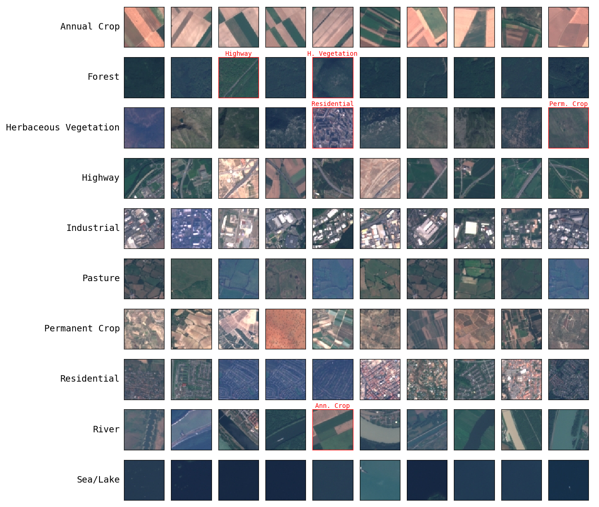

# Image Classification using LeNet, VGGNet and ResNet on Fashion MNIST, CIFAR-10 and EuroSAT datasets

This project aims to show how to create and train LeNet, VGGNet and ResNet Convolutional Network models for image classification from scratch using PyTorch. It shows the results of training on Fashion MNIST, CIFAR-10 and EuroSAT datasets. Each model was trained on each dataset so there are 9 models in total. No pre-trained models were used.

## Description

### Datasets

#### Fashion MNIST Dataset

[Fashion MNIST](https://pytorch.org/vision/main/generated/torchvision.datasets.FashionMNIST.html) is a dataset of images of clothing items, designed to serve as a more complex replacement for the original MNIST dataset of handwritten digits. It consists of 70,000 grayscale images, each of size 28x28 pixels, and is divided into 60,000 training examples and 10,000 test examples.

The dataset contains 10 different classes of clothing items, each with 6,000 images in the training set and 1,000 images in the test set. The classes are as follows: (1) T-shirt/top, (2) Trouser, (3) Pullover, (4) Dress, (5) Coat, (6) Sandal, (7) Shirt, (8) Sneaker, (9) Bag and (10) Ankle boot.

#### CIFAR-10 Dataset

The [CIFAR-10](https://pytorch.org/vision/main/generated/torchvision.datasets.CIFAR10.html) dataset is a widely-used benchmark dataset for image classification tasks in computer vision. It consists of 60,000 color images in 10 different classes, with 6,000 images per class. The dataset is divided into 50,000 training images and 10,000 test images, and were collected from a variety of sources.

The images are of size 32x32 pixels and are labeled with one of the following classes: (1) Airplane, (2) Automobile, (3) Bird, (4) Cat, (5) Deer, (6) Dog, (7) Frog, (8) Horse, (9) Ship and (10) Truck.

#### EuroSAT Dataset

The [EuroSAT](https://pytorch.org/vision/main/generated/torchvision.datasets.EuroSAT.html) dataset is a benchmark dataset for land use and land cover classification tasks in remote sensing and computer vision. It consists of 27,000 satellite images of size 64x64 pixels, covering 10 different land use and land cover classes commonly found in Europe. The images were acquired by the Sentinel-2 satellite and preprocessed to ensure consistency in terms of resolution, band selection, and geometric correction.

The classes are as follows: (1) Annual Crop, (2) Forest, (3) Herbaceous Vegetation, (4) Highway, (5) Industrial, (6) Pasture, (7) Permanent Crop, (8) Residential, (9), River and (10) Sea/Lake.

### CNN Architecture

The CNN architectures used are as follows:
- **LeNet**: Based on the default LeNet5 architecture. See ```lenet.py```.
- **VGGNet**: A smaller version of VGGNet with 3 blocks of 3 convolutional layers each. Each convolutional layer has batch normalization and ReLU non-linearity. Each convolutional block is followed by a max pooling layer (in the 1st 2 blocks) and a global average pooling layer (in the 3rd block). Finally, there is a fully-connected layer for the label classification. See ```vggnet.py```.
- **ResNet**: A smaller version of ResNet with four blocks of convolutional layers. The convolutional blocks have batch normalization, ReLU non-linearity and skip connections. After the convolutional blocks, there is a global average pooling layer followed by a fully-connected layer for the label classification. See ```resnet.py```.


### Technologies

- Python
- Jupyter notebooks
- PyTorch
- Matplotlib

## Results

The outcomes presented were produced by training on the default model (i.e. as described in the CNN architecture above), and no regularization techniques were employed yet. However, I intend to proceed with further experiments that incorporate regularization.

### Fashion MNIST

Test accuracy of LeNet, VGGNet and ResNet on Fashion MNIST dataset:
- LeNet: **88.63%**
- VGGNet: **92.68%** - best
- ResNet: **92.18%**

Train and test accuracy curves of LeNet, VGGNet and ResNet, respectively:
<p float=left>


</p>

Train and test loss curves of LeNet, VGGNet and ResNet, respectively:
<p float=left>


</p>

Below are random images grouped by their predicted class. Incorrectly predicted images are outlined in red, and the correct labels are displayed in red font.

LeNet predictions:


VGGNet predictions:


ResNet predictions:


**Observations:** Many of the incorrect predictions made by the models are difficult for humans to distinguish as well. For example, some shirts were predicted as t-shirts or tops, but it is also challenging to differentiate between them just by looking. Similarly, some coats were misclassified as dresses, etc.

Classification report per classes:

LeNet:
| Label | Precision | Recall | F1-score | |
| ----- | --------- | ------ | -------- |-|
| T-shirt/top | 0.84 | 0.82 | 0.83 | 
| Trouser | 0.98 | 0.97 | 0.98 | best |
| Pullover | 0.86 | 0.82 | 0.84 | 
| Dress | 0.81 | 0.95 | 0.87 | 
| Coat | 0.81 | 0.81 | 0.81 | 
| Sandal | 0.97 | 0.96 | 0.96 | 
| Shirt | 0.72 | 0.65 | 0.68 | worst |
| Sneaker | 0.93 | 0.96 | 0.95 | 
| Bag | 0.97 | 0.97 | 0.97 | 
| Ankle boot | 0.97 | 0.95 | 0.96 | 

VGGNet:
| Label | Precision | Recall | F1-score | |
| ----- | --------- | ------ | -------- |-|
| T-shirt/top | 0.85 | 0.89 | 0.87 | 
| Trouser | 0.99 | 0.99 | 0.99 | best |
| Pullover | 0.9 | 0.9 | 0.9 | 
| Dress | 0.94 | 0.93 | 0.94 | 
| Coat | 0.85 | 0.93 | 0.88 | 
| Sandal | 0.99 | 0.99 | 0.99 | best |
| Shirt | 0.82 | 0.73 | 0.77 | worst |
| Sneaker | 0.96 | 0.98 | 0.97 | 
| Bag | 0.99 | 0.98 | 0.99 | 
| Ankle boot | 0.98 | 0.95 | 0.97 | 

ResNet:
| Label | Precision | Recall | F1-score | |
| ----- | --------- | ------ | -------- |-|
| T-shirt/top | 0.88 | 0.86 | 0.87 | 
| Trouser | 0.98 | 0.99 | 0.99 | 
| Pullover | 0.92 | 0.83 | 0.87 | 
| Dress | 0.93 | 0.93 | 0.93 | 
| Coat | 0.84 | 0.91 | 0.87 | 
| Sandal | 0.99 | 0.99 | 0.99 | best |
| Shirt | 0.77 | 0.79 | 0.78 | worst |
| Sneaker | 0.96 | 0.98 | 0.97 | 
| Bag | 0.99 | 0.99 | 0.99 | best |
| Ankle boot | 0.98 | 0.96 | 0.97 | 

**Observations:** The models have performed best on trousers, sandals, and bags, as they appear the most distinct compared to other classes. On the other hand, the models performed worst on shirts, as it can be difficult to distinguish between shirts and other classes in this dataset, even for humans. Both VGGNet and ResNet performed well on this dataset.

### CIFAR-10

Test accuracy of LeNet, VGGNet and ResNet on CIFAR-10 dataset:
- LeNet: **64.51%**
- VGGNet: **81.35%** - best
- ResNet: **78.45%**

Train and test accuracy curves of LeNet, VGGNet and ResNet, respectively:
<p float=left>


</p>

Train and test loss curves of LeNet, VGGNet and ResNet, respectively:
<p float=left>


</p>

Below are random images grouped by their predicted class. Incorrectly predicted images are outlined in red, and the correct labels are displayed in red font.

LeNet predictions:


VGGNet predictions:


ResNet predictions:


Classification report per classes:

LeNet:
| Label | Precision | Recall | F1-score | |
| ----- | --------- | ------ | -------- |-|
| Plane | 0.74 | 0.62 | 0.67 | 
| Car | 0.74 | 0.79 | 0.77 | best |
| Bird | 0.55 | 0.56 | 0.55 | 
| Cat | 0.49 | 0.41 | 0.44 | worst |
| Deer | 0.57 | 0.64 | 0.6 | 
| Dog | 0.53 | 0.57 | 0.55 | 
| Frog | 0.68 | 0.77 | 0.72 | 
| Horse | 0.76 | 0.62 | 0.68 | 
| Ship | 0.68 | 0.82 | 0.74 | 
| Truck | 0.74 | 0.65 | 0.69 | 

VGGNet:
| Label | Precision | Recall | F1-score | |
| ----- | --------- | ------ | -------- |-|
| Plane | 0.77 | 0.88 | 0.82 | 
| Car | 0.94 | 0.89 | 0.92 | best |
| Bird | 0.78 | 0.69 | 0.74 | 
| Cat | 0.63 | 0.71 | 0.67 | worst |
| Deer | 0.76 | 0.83 | 0.79 | 
| Dog | 0.75 | 0.72 | 0.73 | 
| Frog | 0.87 | 0.84 | 0.86 | 
| Horse | 0.86 | 0.82 | 0.84 | 
| Ship | 0.94 | 0.84 | 0.88 | 
| Truck | 0.89 | 0.9 | 0.9 | 

ResNet:
| Label | Precision | Recall | F1-score | |
| ----- | --------- | ------ | -------- |-|
| Plane | 0.77 | 0.82 | 0.79 | 
| Car | 0.94 | 0.83 | 0.88 | best |
| Bird | 0.67 | 0.77 | 0.71 | 
| Cat | 0.69 | 0.53 | 0.6 | worst |
| Deer | 0.82 | 0.71 | 0.76 | 
| Dog | 0.72 | 0.7 | 0.71 | 
| Frog | 0.79 | 0.88 | 0.83 | 
| Horse | 0.79 | 0.85 | 0.82 | 
| Ship | 0.89 | 0.86 | 0.87 | 
| Truck | 0.78 | 0.92 | 0.84 | 

**Observations:** All three models performed best on car images and worst on cat images. Additionally, the models struggled overall in correctly classifying objects from this dataset.

### EuroSAT

Test accuracy of LeNet, VGGNet and ResNet on EuroSAT dataset:
- LeNet: **85.81%**
- VGGNet: **95.85%**
- ResNet: **97.81%** - best

Train and test accuracy curves of LeNet, VGGNet and ResNet, respectively:
<p float=left>


</p>

Train and test loss curves of LeNet, VGGNet and ResNet, respectively:
<p float=left>


</p>

Below are random images grouped by their predicted class. Incorrectly predicted images are outlined in red, and the correct labels are displayed in red font.

LeNet predictions:


VGGNet predictions:


ResNet predictions:


Classification report per classes:

LeNet:
| Label | Precision | Recall | F1-score | |
| ----- | --------- | ------ | -------- |-|
| Annual Crop | 0.84 | 0.91 | 0.87 | 
| Forest | 0.9 | 0.97 | 0.93 | 
| Herbaceous Vegetation | 0.83 | 0.69 | 0.75 | 
| Highway | 0.85 | 0.54 | 0.66 | worst |
| Industrial | 0.91 | 1.0 | 0.95 | 
| Pasture | 0.82 | 0.77 | 0.79 | 
| Permanent Crop | 0.7 | 0.88 | 0.78 | 
| Residential | 0.94 | 0.98 | 0.96 | 
| River | 0.8 | 0.85 | 0.82 | 
| Sea/Lake | 0.98 | 0.97 | 0.98 | best |

VGGNet:
| Label | Precision | Recall | F1-score | |
| ----- | --------- | ------ | -------- |-|
| Annual Crop | 1.0 | 0.9 | 0.94 | 
| Forest | 0.98 | 1.0 | 0.99 | 
| Herbaceous Vegetation | 0.94 | 0.93 | 0.93 | 
| Highway | 0.98 | 0.92 | 0.95 | 
| Industrial | 1.0 | 0.95 | 0.97 | 
| Pasture | 0.97 | 0.97 | 0.97 | 
| Permanent Crop | 0.86 | 0.98 | 0.92 | worst |
| Residential | 0.97 | 0.96 | 0.96 | 
| River | 0.93 | 0.98 | 0.95 | 
| Sea/Lake | 0.99 | 1.0 | 0.99 | best |

ResNet:
| Label | Precision | Recall | F1-score | |
| ----- | --------- | ------ | -------- |-|
| Annual Crop | 1.0 | 0.98 | 0.99 | best |
| Forest | 1.0 | 0.93 | 0.96 | 
| Herbaceous Vegetation | 0.9 | 0.99 | 0.95 | worst |
| Highway | 0.99 | 0.99 | 0.99 | best |
| Industrial | 0.99 | 0.97 | 0.98 | 
| Pasture | 0.98 | 0.97 | 0.97 | 
| Permanent Crop | 0.99 | 0.98 | 0.98 | 
| Residential | 1.0 | 0.97 | 0.99 | 
| River | 0.98 | 1.0 | 0.99 | best |
| Sea/Lake | 0.98 | 1.0 | 0.99 | best |

**Observations:** VGGNet and ResNet have performed well on this dataset. In terms of class-wise performance, all models achieved high accuracy for the sea/lake class, as sea and lakes can have similar appearances across different locations.

## Getting Started

Clone the repository and setup environment:

```
pip install -r requirements.txt
```

Open the notebook ```train_cnn.ipynb``` and modify the following variables, located in the 2nd cell, as described in the notebook:

```
skip_training
run_settings
```

Run all the cells. 

&nbsp;

**Reminders:**

If you have already run the training, ensure that you backup or rename the models you want to keep before re-training.

Additionally, you can set your own naming convention for the model and log files by modifying the value of ```save_path``` in the ```run_archi_on_dataset()``` function, located in the fifth cell.
